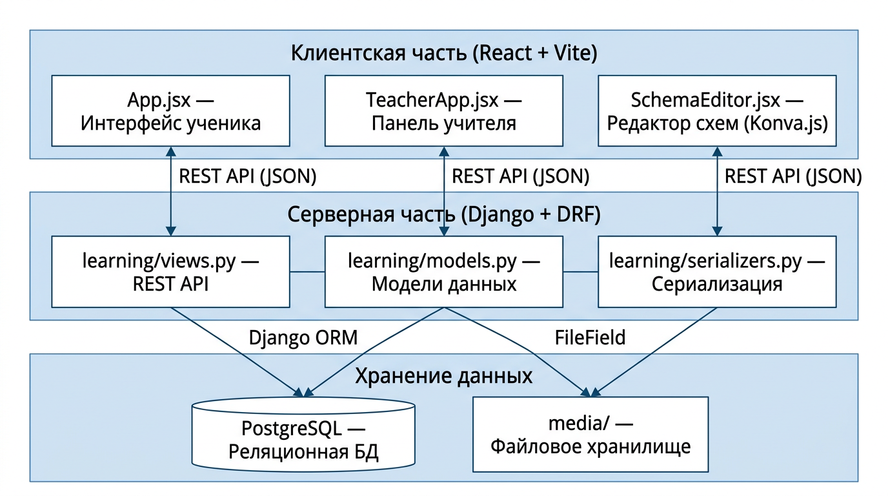
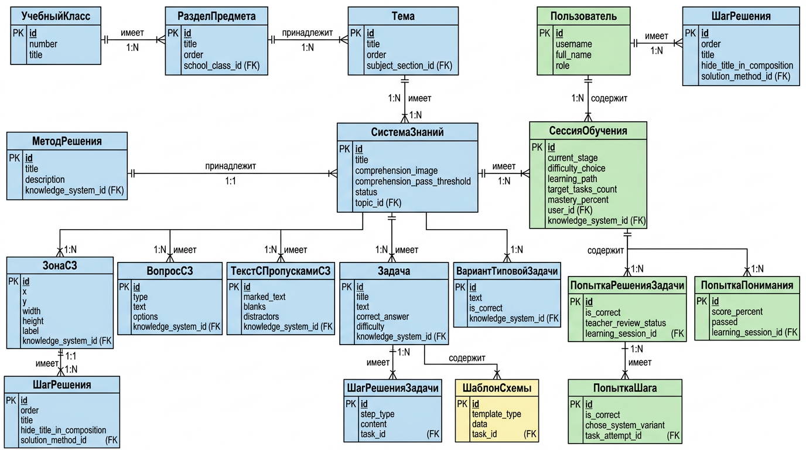
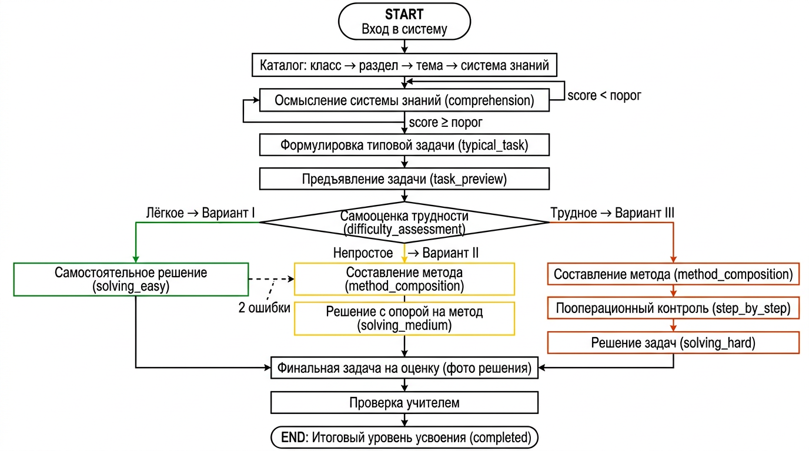
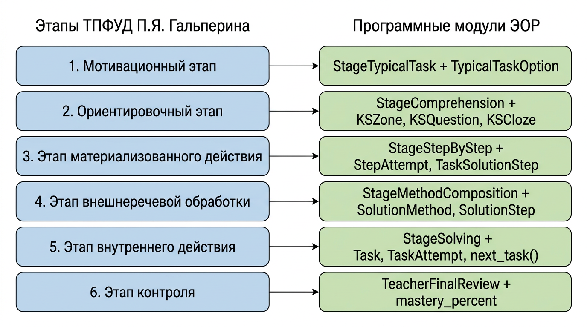

# ЧЕРНОВИК НАУЧНОЙ СТАТЬИ

---

## 0. МЕТАИНФОРМАЦИЯ

### 0.1. Тип статьи и центральная идея

**Тип:** теоретико-методическая / проектная статья без апробационных данных.

**Центральная идея:** показать, каким образом положения теории поэтапного формирования умственных действий П. Я. Гальперина (в интерпретации Л. А. Прояненковой для обучения физике) транслируются в архитектуру, модели данных и алгоритмы электронного образовательного ресурса, предназначенного для организации усвоения учащимися 7–9 классов систем знаний о физических явлениях.

### 0.2. Три варианта названия статьи

1. **«От теории поэтапного формирования умственных действий к архитектуре электронного образовательного ресурса по физике»**
2. **«Проектирование электронного образовательного ресурса для усвоения систем физических знаний на основе концепции П. Я. Гальперина: от педагогического алгоритма к программной реализации»**
3. **«Реализация этапов формирования умственных действий в электронном образовательном ресурсе по физике для основной школы»**

### 0.3. Цель статьи

Раскрыть логику перехода от теории поэтапного формирования умственных действий П. Я. Гальперина и её конкретизации в методике обучения физике к проектным решениям электронного образовательного ресурса: описать педагогический алгоритм организации усвоения систем физических знаний и показать, как каждый его элемент реализован в программных модулях, моделях данных и пользовательских сценариях ЭОР.

### 0.4. Научная новизна (без вымышленных результатов)

Научная новизна состоит в том, что впервые предложена и реализована модель электронного образовательного ресурса, в которой:
- архитектура системы (модели данных, маршрут ученика, API-интерфейсы) непосредственно выведена из этапов теории поэтапного формирования умственных действий и их конкретизации для обучения физике;
- варианты последовательности усвоения (I — лёгкое, II — непростое, III — трудное), описанные Л. А. Прояненковой и соавторами для работы с системами физических знаний, воплощены в программируемой логике переходов между этапами учебной сессии;
- механизм адаптивного подбора задач определяется не только автоматической оценкой, но и самооценкой учеником трудности задания, что является программной реализацией дидактического принципа учёта индивидуальных возможностей.

### 0.5. Практическая значимость (без ссылок на пилотное внедрение)

Практическая значимость определяется тем, что разработанный ЭОР представляет собой готовый к внедрению программный продукт, который:
- может быть развёрнут в школьной образовательной среде с минимальными техническими требованиями (веб-сервер, база данных);
- предоставляет учителю интерфейс для самостоятельного наполнения ресурса учебным контентом (системами знаний, задачами, методами решения, графическими схемами) без знания программирования;
- позволяет организовать индивидуальную траекторию усвоения системы знаний для каждого ученика;
- может быть адаптирован для иных естественно-научных дисциплин при сохранении общей архитектуры.

---

## 0.6. Публикации Л. А. Прояненковой, которые логично цитировать

1. **Прояненкова Л. А.** Деятельностный подход в обучении физике // Физика в школе. — 2005. — № 1. *(Обоснование деятельностного подхода, применение ТПФУД в методике физики.)*
2. **Прояненкова Л. А. и соавторы.** Работы по методике обучения физике, в которых описываются:
   - три варианта последовательности этапов формирования знаний и действий (вариант I, II, III);
   - дидактические материалы для организации поэтапного усвоения;
   - процедуры управления учебной деятельностью при усвоении систем физических знаний.

> **Примечание.** В тексте диплома основной ссылкой на работы Прояненковой является источник [19] (теория и методика обучения физике) и [22] (статья 2005 г. в «Физике в школе»). Для статьи рекомендуется уточнить полные библиографические описания этих источников.

### 0.7. Где в статье ссылаться на Гальперина, а где — на Прояненкову

| Место в статье | Гальперин | Прояненкова |
|---|---|---|
| Введение: обоснование ТПФУД как теоретической основы | ✓ | — |
| Методы исследования: теоретическое моделирование на основе ТПФУД | ✓ | ✓ (конкретизация для физики) |
| Алгоритм ЭОР: этапы формирования (мотивационный, ориентировочный, материализованного действия, внешнеречевой, внутреннего действия, контроля) | ✓ | — |
| Алгоритм ЭОР: три варианта последовательности (I, II, III) | — | ✓ |
| Алгоритм ЭОР: система знаний как единица усвоения | ✓ | ✓ |
| Алгоритм ЭОР: ориентировочная основа действия (ООД) | ✓ | ✓ (конкретизация для физики: таблица СК) |
| Алгоритм ЭОР: метод решения задач как алгоритм действий | — | ✓ |
| Техническая реализация: адаптивный маршрут | — | ✓ (три варианта → три маршрута) |
| Заключение: научно-методическая новизна | ✓ | ✓ |

---

## 1. ПОДРОБНЫЙ ПЛАН СТАТЬИ

### Введение
1.1. Актуальность проблемы формирования систем физических знаний у школьников (ФГОС, кодификатор ОГЭ, статистика выполнения заданий 21–25).
1.2. Ограничения существующих ЭОР: фрагментарность, отсутствие поэтапной логики усвоения, контроль только на финальном этапе.
1.3. ТПФУД П. Я. Гальперина как теоретическое основание для проектирования ЭОР.
1.4. Противоречие: между дидактическим потенциалом ТПФУД и отсутствием ЭОР, реализующих эту теорию.
1.5. Цель статьи.

### Методы исследования
2.1. Анализ психолого-педагогической и методической литературы.
2.2. Анализ нормативных требований к ЭОР (ФГОС, ГОСТ Р 53620-2009, приказ №243).
2.3. Теоретическое моделирование процесса усвоения.
2.4. Педагогическое проектирование алгоритма работы ЭОР.
2.5. Структурно-функциональное моделирование архитектуры системы.
2.6. Моделирование предметной области (ER-моделирование).
2.7. Проектирование клиент-серверной архитектуры и REST API.
2.8. Прототипирование программного решения.

### Алгоритм работы ЭОР (педагогический план)
3.1. Вход в систему, навигация по каталогу (класс → раздел → тема → система знаний).
3.2. Этап осмысления системы знаний (ориентировочный этап по ТПФУД).
3.3. Формулировка типовой задачи на применение системы знаний (мотивационный этап).
3.4. Предъявление списка задач.
3.5. Выяснение степени трудности задания (самооценка ученика).
3.6. Три варианта маршрута по Прояненковой:
  - Вариант I (лёгкое): самостоятельное решение задач.
  - Вариант II (непростое): составление метода решения → решение задач.
  - Вариант III (трудное): составление метода → пооперационный контроль → проговаривание → свёрнутое решение.
3.7. Адаптивный подбор задач на каждом маршруте.
3.8. Контроль и оценка результатов.

### Техническая реализация
4.1. Общая архитектура: клиент-сервер, Django + React + PostgreSQL.
4.2. Модели данных: иерархия курса, система знаний, осмысление, метод решения, задачи, сессии, попытки.
4.3. Модуль осмысления системы знаний: интерактивные зоны, вопросы, клоуз-тесты.
4.4. Модуль типовой задачи.
4.5. Модуль самооценки трудности и выбора маршрута.
4.6. Модуль метода решения задач и составления метода.
4.7. Модуль пооперационного контроля (пошаговое решение).
4.8. Модуль решения задач с адаптивным подбором.
4.9. Редактор графических схем (Konva.js).
4.10. Интерфейс учителя.
4.11. Учебная сессия: логика переходов между этапами.
4.12. Формула расчёта итогового усвоения.

### Заключение
5.1. Что спроектировано и реализовано.
5.2. Научно-методическая новизна.
5.3. Практическая значимость как проектного решения.
5.4. Перспективы апробации и развития.

---

## 2. ТАБЛИЦА СООТВЕТСТВИЯ ТЕОРИИ ГАЛЬПЕРИНА И МОДУЛЕЙ ЭОР

| № | Этап / идея по Гальперину | Педагогическая функция | Модуль / сущность / сценарий в ЭОР | Подтверждение в коде |
|---|---|---|---|---|
| 1 | **Мотивационный этап** — создание условий для принятия учебной цели | Ученик осознаёт, зачем нужно освоить систему знаний; видит конкретную типовую задачу и ситуацию её применения | Этап `typical_task` в `LearningSession`; компонент `StageTypicalTask` в `App.jsx`; модель `TypicalTaskOption` | `LearningSession.current_stage == "typical_task"`; `STAGE_CHOICES` в `models.py`; `TypicalTaskOption` (поля `text`, `is_correct`, `explanation`); эндпоинт `POST /api/session/{id}/submit_typical_task/` |
| 2 | **Ориентировочный этап** — знакомство с ориентировочной основой действия (ООД) | Ученик осмысливает систему знаний через таблицу/схему, отвечает на вопросы для проверки понимания структуры знания | Этап `comprehension`; компонент `StageComprehension`; модели `KnowledgeSystem` (`comprehension_image`), `KSZone`, `KSQuestion`, `KSCloze` | `POST /api/ks/{id}/check/` — проверка ответов осмысления; `ComprehensionAttempt`, `QuestionAnswer`, `ClozeAnswer`; порог `comprehension_pass_threshold` |
| 3 | **Составление алгоритма действия** (ООД-II) | Ученик знакомится с методом решения задач или восстанавливает его | Этап `method_composition`; компонент `StageMethodComposition`; модели `SolutionMethod`, `SolutionStep` | `POST /api/ks/{id}/check_method_composition/`; `SolutionStep.hide_title_in_composition`; `shuffleMethodStepsForChallenge()` в `App.jsx` |
| 4 | **Этап материализованного действия** — выполнение с внешней опорой, пооперационный контроль | Ученик решает задачу шаг за шагом по методу, с проверкой каждого действия и возможностью выбрать свой или системный вариант | Этап `step_by_step`; компонент `StageStepByStep`; модель `StepAttempt`; `TaskSolutionStep` | `POST /api/task/{id}/check_step/`; `POST /api/task/{id}/choose_step_variant/`; `POST /api/task/{id}/complete_guided/`; `StepAttempt.chose_system_variant` |
| 5 | **Этап внешнеречевой обработки** — проговаривание действий | Ученик решает задачи, проговаривая метод, без пооперационного контроля | Этап `solving_medium`; кнопки-подсказки «Система знаний» и «Метод решения» в интерфейсе решения | `LearningSession.current_stage == "solving_medium"`; переход `method_composition → solving_medium` в `ALLOWED_STAGE_TRANSITIONS` |
| 6 | **Этап внутреннего (умственного) действия** — самостоятельное решение без внешних опор | Ученик решает задачи самостоятельно, в уме, без подсказок | Этап `solving_easy`; компонент `StageSolving` | `LearningSession.current_stage == "solving_easy"`; адаптивный алгоритм `next_task` |
| 7 | **Этап контроля** — оценка сформированности действия | Ученик выполняет финальную задачу на оценку; учитель проверяет фото решения | Завершающая задача с загрузкой фото; `TaskAttempt.teacher_review_status`; `TeacherFinalTaskReviewViewSet` | `POST /api/task/{id}/submit/` (последняя задача → `teacher_review_status = "pending"`); `_recalculate_mastery_after_teacher_review()`; `teacher_final_mark` 2–5 |
| 8 | **Три варианта последовательности** (Прояненкова) | Дифференциация маршрута в зависимости от самооценки трудности | `difficulty_choice` (`easy` / `medium` / `hard`); `learning_path` (`self_solve` / `review_example` / `discuss_and_review`); граф `ALLOWED_STAGE_TRANSITIONS` | `POST /api/session/{id}/set_difficulty/` → устанавливает `target_tasks_count` (5/6/8); `POST /api/session/{id}/set_learning_path/`; маршруты: easy → `solving_easy`; medium → `method_composition` → `solving_medium`; hard → `method_composition` → `step_by_step` |
| 9 | **Система знаний как единица усвоения** | Учебный материал организован не по отдельным понятиям, а как целостная система знаний о физическом явлении | Модель `KnowledgeSystem` — центральная сущность, объединяющая осмысление, метод, задачи | `KnowledgeSystem` → `KSZone`, `KSQuestion`, `KSCloze`, `SolutionMethod`, `Task`; иерархия `SchoolClass` → `SubjectSection` → `Topic` → `KnowledgeSystem` |
| 10 | **Управление усвоением и обратная связь** | Фиксация микрорезультатов на каждом этапе, автоматизированная обратная связь | `LearningSession` (все поля прогресса); `EventLog`; адаптивный `next_task` | `tasks_solved_count`, `tasks_correct_count`, `wrong_attempts_in_row`, `step_error_history`, `comprehension_score`, `mastery_percent`; `EventLog.event`, `EventLog.payload` |
| 11 | **Сценарий «двух ошибок»** — возврат к внешней опоре при затруднениях | При двух ошибках подряд ученик получает дополнительную поддержку (составление метода, клоуз по шагам) | `ErrorBranchingBlock` в `App.jsx`; `scenario_two_errors_used`; `buildScenario631ClozeData()` | `POST /api/session/{id}/mark_scenario_two_errors_used/`; переход `solving_easy → step_by_step` в `ALLOWED_STAGE_TRANSITIONS`; функция `buildScenario631ClozeData()` формирует клоуз из `SolutionStep.title` |

---

## 3. ЧЕРНОВИК ВВЕДЕНИЯ

Формирование целостной системы знаний о физических явлениях является одной из ключевых задач обучения физике в основной школе. Федеральный государственный образовательный стандарт основного общего образования [1] и федеральная рабочая программа по физике [2] предъявляют к предметным результатам обучения требования, связанные с умением учащихся объяснять физические процессы с опорой на изученные свойства явлений, законы и модели, а также решать расчётные задачи с использованием систем уравнений. Между тем анализ статистико-аналитических отчётов о результатах основного государственного экзамена по физике за 2024 год по ряду регионов России свидетельствует о том, что задания, требующие применения систем знаний (задания 21–25 в спецификации КИМ ОГЭ), выполняются с процентом от 23 до 53 %, что указывает на системные затруднения школьников [3].

Электронные образовательные ресурсы (ЭОР) обладают значительным потенциалом для преодоления указанных затруднений: они способны обеспечить интерактивность, мгновенную обратную связь и индивидуализацию образовательной траектории [4]. Однако анализ практики показывает, что существующие ЭОР по физике зачастую ограничиваются демонстрационными материалами, наборами разрозненных задач или тестами с финальной проверкой [5]. Контроль за правильностью выполнения заданий осуществляется, как правило, только на завершающем этапе работы с ресурсом, что затрудняет своевременное выявление и коррекцию ошибок. Целенаправленная организация поэтапного усвоения системы знаний в цифровой среде в существующих решениях не представлена.

Одним из перспективных оснований для проектирования такого ресурса выступает теория поэтапного формирования умственных действий и понятий (ТПФУД), разработанная П. Я. Гальпериным [6]. Теория описывает последовательность этапов интериоризации — перехода действия из внешнего плана во внутренний: от ориентировки и материализованного действия через внешнеречевую обработку к действию в умственном плане. Реализация ТПФУД в методике обучения физике, развитая Л. А. Прояненковой [7, 8], показала, что для каждой системы знаний возможно выделить три варианта последовательности этапов формирования, различающихся степенью развёрнутости внешних опор и соответствующих уровню подготовленности ученика. Однако комплексный электронный ресурс, в архитектуре которого этапы ТПФУД были бы реализованы как программные модули, а варианты маршрутов — как алгоритмически управляемые переходы, до настоящего времени не был представлен.

Таким образом, существует противоречие между дидактическим потенциалом теории поэтапного формирования умственных действий для организации усвоения систем физических знаний и отсутствием электронных образовательных ресурсов, в которых эта теория реализована на уровне архитектуры и алгоритмов системы.

**Цель статьи** — раскрыть логику проектирования электронного образовательного ресурса по физике для основной школы, в котором архитектура системы, модели данных и алгоритмы взаимодействия непосредственно выведены из теории поэтапного формирования умственных действий и её конкретизации в методике обучения физике.

---

## 4. ЧЕРНОВИК РАЗДЕЛА «МЕТОДЫ ИССЛЕДОВАНИЯ»

В работе применён комплекс теоретических и проектных методов исследования.

**Анализ психолого-педагогической и методической литературы** использован для выявления закономерностей формирования систем знаний, этапов усвоения умственных действий по П. Я. Гальперину [6] и их конкретизации в методике обучения физике [7, 8]. Результатом анализа стало выделение инвариантной последовательности этапов усвоения (мотивационный, ориентировочный, материализованного действия, внешнеречевой обработки, внутреннего действия, контроля) и трёх вариантов маршрута, различающихся полнотой внешней опоры.

**Анализ нормативных требований** к электронным образовательным ресурсам (ФГОС ООО, ГОСТ Р 53620-2009, приказ Минпросвещения России № 243 от 15.04.2022) позволил определить функциональные, технические и содержательные требования к проектируемому ЭОР: совместимость с различными устройствами, поддержка интерактивных форматов, обеспечение фиксации хода и результатов образовательного процесса.

**Теоретическое моделирование** применено для построения обобщённой модели взаимодействия учителя и учащегося в процессе усвоения системы физических знаний. Модель включает описание учебных действий, их последовательности и условий перехода между этапами.

**Педагогическое проектирование** использовано для разработки алгоритма работы ЭОР на уровне организации учебной деятельности: определены учебные сценарии для каждого из трёх вариантов маршрута, описаны условия переходов между этапами, виды обратной связи и точки принятия решений учеником.

**Структурно-функциональное моделирование** положено в основу проектирования архитектуры ЭОР: выделены функциональные подсистемы (каталог учебного содержания, модуль осмысления системы знаний, модуль метода решения, модуль решения задач, модуль контроля, интерфейс учителя) и определены связи между ними.

**Моделирование предметной области** реализовано в форме ER-моделирования: разработана реляционная модель данных, отражающая иерархию учебного курса (класс — раздел — тема — система знаний) и структуру учебной сессии ученика.

**Проектирование клиент-серверной архитектуры** включало определение протоколов взаимодействия (REST API), разделение серверной логики (Django, Django REST Framework) и клиентского интерфейса (React), обоснование выбора СУБД (PostgreSQL).

**Прототипирование программного решения** состояло в реализации функционального прототипа ЭОР, включающего все спроектированные модули, и его верификации на соответствие педагогическому алгоритму.

---

## 5. ЧЕРНОВИК РАЗДЕЛА «АЛГОРИТМ РАБОТЫ ЭОР В ПЕДАГОГИЧЕСКОМ ПЛАНЕ»

Алгоритм работы электронного образовательного ресурса воспроизводит логику организации усвоения систем физических знаний, основанную на теории поэтапного формирования умственных действий П. Я. Гальперина [6] и её конкретизации в методике обучения физике [7, 8]. Единицей усвоения в ЭОР является **система знаний** о физическом явлении — совокупность взаимосвязанных понятий, моделей и законов, необходимых для решения определённого класса задач.

### 5.1. Навигация и выбор системы знаний

Ученик входит в систему и видит каталог учебного содержания, организованный в иерархию: класс → раздел предмета → тема → система знаний. Такая организация воспроизводит структуру учебной программы и позволяет ученику ориентироваться в материале. При выборе системы знаний создаётся учебная сессия, фиксирующая прогресс ученика на всех последующих этапах.

### 5.2. Осмысление системы знаний (ориентировочный этап)

Первым содержательным этапом работы является осмысление системы знаний, соответствующее ориентировочному этапу по ТПФУД. Ученику предъявляется таблица или схема, представляющая систему знаний о физическом явлении, в которой отражены основные понятия, модели, законы и связи между ними. Данная таблица выполняет функцию **ориентировочной основы действия** (ООД): она показывает ученику структуру знания, условия и способы его применения.

Для проверки осмысления ученик отвечает на вопросы различных типов: выбор одного или нескольких вариантов ответа, соотнесение элементов таблицы с понятиями (выбор зон на изображении), заполнение пропусков в тексте (клоуз-тест). Проверка выполняется автоматически; для успешного прохождения этапа необходимо набрать не менее заданного порога правильных ответов (по умолчанию 85 %). При недостаточном результате ученик имеет возможность повторить попытку.

### 5.3. Формулировка типовой задачи (мотивационный этап)

После осмысления системы знаний ученику предъявляется типовая задача на применение данной системы. Этот этап выполняет мотивационную функцию: ученик осознаёт, для решения каких практических задач необходимы усвоенные знания. Ученику предлагается определить формулировку типовой задачи из нескольких вариантов; после ответа предъявляется пояснение, раскрывающее цель и ситуации применения системы знаний. Также может использоваться задание в формате клоуз-теста для проверки понимания формулировки.

### 5.4. Предъявление списка задач и выяснение степени трудности

Далее ученику предъявляется первая задача на применение системы знаний. Он вводит ответ и получает обратную связь (правильный ответ, фрагменты решения). После этого ученику предлагается оценить трудность задания: **лёгкое**, **непростое** или **трудное**. Самооценка ученика определяет дальнейший маршрут обучения — один из трёх вариантов последовательности этапов формирования, описанных Л. А. Прояненковой [7].

### 5.5. Три варианта маршрута обучения

**Вариант I — «Лёгкое».** Ученик, оценивший задание как лёгкое, переходит к самостоятельному решению задач. Он последовательно решает задачи, вводя числовой ответ и при необходимости загружая фотографию решения. Система автоматически подбирает следующую задачу с учётом текущего уровня подготовленности. Целевое количество задач — 5. Этот маршрут соответствует этапу внутреннего (умственного) действия: ученик решает задачи в уме, без внешних опор.

**Вариант II — «Непростое».** Ученик сначала знакомится с методом решения задач — общей последовательностью действий, вытекающей из системы знаний. На этапе **составления метода** часть названий действий скрыта, и ученик должен восстановить их, что обеспечивает активную переработку алгоритма. После составления метода ученик переходит к решению задач (целевое количество — 6), имея возможность обращаться к системе знаний и методу решения в качестве подсказки. Этот маршрут соответствует сочетанию ориентировочного и внешнеречевого этапов: ученик опирается на алгоритм (ООД), но не проходит через развёрнутый пооперационный контроль.

**Вариант III — «Трудное».** Наиболее развёрнутый маршрут включает все формы действия. Ученик составляет метод решения, затем проходит **пооперационный контроль**: решает одну-две задачи с проверкой каждого шага метода. На каждом шаге система предъявляет эталонный результат и предлагает ученику выбрать свой вариант или вариант системы. Далее ученик решает задачи с проговариванием метода (без пооперационного контроля, но с доступом к подсказкам), после чего переходит к свёрнутому решению и финальному заданию на оценку. Целевое количество задач увеличено. Этот маршрут воспроизводит полный цикл этапов ТПФУД: от материализованного действия к внешнеречевой обработке и далее к внутреннему действию.

### 5.6. Адаптивный подбор задач

Независимо от маршрута система использует адаптивный алгоритм подбора следующей задачи. Алгоритм учитывает: (а) базовый уровень сложности, определяемый самооценкой ученика; (б) текущую серию правильных или неправильных ответов; (в) общий процент успешности в сессии. При высокой успешности (≥ 80 %) уровень сложности повышается, при низкой (< 60 %) — понижается; при двух ошибках подряд уровень также снижается. Тем самым обеспечивается нахождение задач в «зоне ближайшего развития» ученика.

### 5.7. Сценарий поддержки при затруднениях («две ошибки»)

Если ученик, работающий по варианту I (лёгкое), допускает две ошибки подряд, система предлагает перейти к более развёрнутому маршруту: составить метод решения, выполнить клоуз-тест по шагам метода или перейти к пооперационному контролю. Данный сценарий реализует дидактический принцип: при обнаружении затруднения обучение возвращается к более внешним формам действия.

### 5.8. Контроль и оценка

Завершающей задачей в каждом маршруте является задание на оценку. Ученик решает задачу, загружает фотографию развёрнутого решения и отправляет её на проверку учителю. Учитель проверяет решение, выставляет отметку по шкале 2–5 и принимает или отклоняет работу. Итоговый уровень усвоения вычисляется как интегральный показатель, учитывающий автоматическую оценку (процент правильных ответов), экспертную оценку учителя и активность ученика в системе.

---

## 6. ЧЕРНОВИК РАЗДЕЛА «ТЕХНИЧЕСКАЯ РЕАЛИЗАЦИЯ»

### 6.1. Общая архитектура

ЭОР реализован по клиент-серверной архитектуре. Серверная часть построена на фреймворке Django (Python) с использованием Django REST Framework для создания API. Клиентская часть — одностраничное приложение (SPA) на React (JavaScript), собираемое инструментом Vite и стилизованное с помощью Tailwind CSS. Для работы с векторной графикой (редактор схем) используется библиотека Konva.js. В качестве СУБД используется PostgreSQL (SQLite — для разработки). Взаимодействие клиента и сервера осуществляется через REST API в формате JSON; аутентификация — на основе сессий и CSRF-токенов.

Система разделена на две функциональные зоны: **интерфейс ученика** (файл `App.jsx`) и **панель учителя** (файл `TeacherApp.jsx`). Разграничение доступа реализовано на уровне API: ученические эндпоинты доступны всем аутентифицированным пользователям, учительские — только пользователям с атрибутом `is_staff`.

### 6.2. Модели данных

Структура базы данных отражает как предметную область (учебный курс по физике), так и процесс усвоения (учебная сессия ученика). Модели данных реализованы в файле `learning/models.py`.

#### Иерархия учебного курса

Учебный материал организован в четырёхуровневую иерархию:

- **`SchoolClass`** (класс обучения) — содержит номер класса (`number`) и название (`title`).
- **`SubjectSection`** (раздел предмета) — связан с классом через внешний ключ; содержит название и порядковый номер (`order`).
- **`Topic`** (тема) — связана с разделом; содержит название и порядковый номер.
- **`KnowledgeSystem`** (система знаний) — центральная сущность, связанная с темой. Содержит название, описание, изображение для осмысления (`comprehension_image`), порог успешности осмысления (`comprehension_pass_threshold`, по умолчанию 85 %), формулировку типовой задачи (`typical_task_cloze_text`, `typical_task_cloze_blanks`), статус публикации (`status`: draft/published).

Данная иерархия реализует дидактический принцип организации учебного материала по системам знаний: каждая система знаний является замкнутой единицей усвоения, содержащей все средства для работы по алгоритму ТПФУД.

#### Модели осмысления системы знаний

- **`KSZone`** — прямоугольная зона на изображении таблицы системы знаний (`x`, `y`, `width`, `height`, `label`). Зоны используются для интерактивных вопросов типа «соответствие».
- **`KSQuestion`** — вопрос для осмысления; поддерживает типы: `text` (открытый ответ), `single` (выбор одного), `multiple` (множественный выбор), `match` (соответствие зон). Поле `correct_zones` (M2M) хранит правильные зоны для типа `match`; поле `options` (JSON) — варианты ответов.
- **`KSCloze`** — текст с пропусками; содержит размеченный текст (`marked_text`), структуру пропусков (`blanks`, JSON) и отвлекающие варианты (`distractors`, JSON).
- **`ComprehensionAttempt`**, **`QuestionAnswer`**, **`ClozeAnswer`** — фиксация результатов осмысления.

#### Модели метода решения

- **`SolutionMethod`** — метод решения задач, связан с `KnowledgeSystem` отношением «один-к-одному».
- **`SolutionStep`** — шаг метода; содержит порядковый номер (`order`), название действия (`title`), описание (`description`), подсказку (`hint`), флаг скрытия названия при составлении (`hide_title_in_composition`).

Флаг `hide_title_in_composition` играет ключевую роль в реализации ориентировочного этапа: учитель отмечает, какие шаги метода ученик должен восстановить самостоятельно, а какие предъявляются готовыми.

#### Модели задач

- **`Task`** — задача; содержит текст условия, правильный ответ (`correct_answer`, числовой; `correct_answer_text`, текстовый), единицу измерения (`answer_unit`), допустимую погрешность (`answer_tolerance`), уровень сложности (`difficulty`, 1–5), эталонные решения (`solution_summary`, `solution_detailed`, `solution_image`).
- **`TaskSolutionStep`** — результат выполнения конкретного шага метода для конкретной задачи; содержит тип шага (`step_type`: text, text_pick, symbol, boolean, solution, schema), содержимое (`content`), данные схемы (`schema_data`, JSON).

#### Модели графических схем

- **`SchemaElementCategory`**, **`SchemaElement`** — палитра графических элементов (векторы, точки, линии, оси, тела и др.) с SVG-шаблонами и редактируемыми свойствами.
- **`SchemaTemplate`** — шаблон схемы для задачи; типы: `reference` (эталонная), `starter` (начальная заготовка), `hint` (подсказка).
- **`StudentSchema`** — схема, созданная учеником; содержит данные (`data`, JSON), оценку сходства с эталоном (`similarity_score`), обратную связь (`feedback`).

#### Модели учебной сессии

- **`LearningSession`** — центральная модель для отслеживания прогресса. Содержит:
  - `current_stage` — текущий этап (13 возможных значений: `comprehension`, `typical_task`, `task_preview`, `learning_path_choice`, `task_list`, `difficulty_assessment`, `solving_easy`, `solving_medium`, `solving_hard`, `method_composition`, `step_by_step`, `verbalization`, `compact_solving`, `diagnostic`, `completed`);
  - `difficulty_choice` — самооценка трудности (`easy` / `medium` / `hard`);
  - `learning_path` — выбранный порядок работы (`self_solve` / `review_example` / `discuss_and_review`);
  - `target_tasks_count` — целевое количество задач;
  - `tasks_solved_count`, `tasks_correct_count`, `wrong_attempts_in_row` — статистика решения;
  - `step_error_history` (JSON) — история ошибок по шагам;
  - `score_percent`, `passed`, `mastery_percent`, `teacher_final_mark` — итоговые показатели.

- **`TaskAttempt`** — попытка решения задачи; содержит ответ ученика, результат проверки, статус проверки учителем (`teacher_review_status`), оценку учителя (`teacher_grade_2_5`).
- **`StepAttempt`** — попытка выполнения шага метода; содержит ответ ученика, результат проверки, флаг выбора системного варианта (`chose_system_variant`).
- **`EventLog`** — лог событий; фиксирует все значимые действия ученика с метками времени.

### 6.3. Логика переходов между этапами

Переходы между этапами учебной сессии контролируются на сервере с помощью графа допустимых переходов (`ALLOWED_STAGE_TRANSITIONS` в `learning/views.py`). При попытке перехода к следующему этапу сервер проверяет, входит ли запрошенный этап в множество допустимых для текущего состояния. Это обеспечивает целостность педагогического алгоритма: ученик не может «перескочить» этап, обязательный для его маршрута.

Граф переходов реализует три маршрута:

- **Маршрут I (лёгкое):** `comprehension → typical_task → task_preview → difficulty_assessment → solving_easy → task_list → ... → completed`.
- **Маршрут II (непростое):** `comprehension → typical_task → difficulty_assessment → method_composition → solving_medium → task_list → ... → completed`.
- **Маршрут III (трудное):** `comprehension → typical_task → difficulty_assessment → method_composition → step_by_step → task_list → ... → completed`.

Переход при двух ошибках подряд: `solving_easy → step_by_step` (возврат к пооперационному контролю).

### 6.4. Модуль осмысления системы знаний

Серверная реализация: эндпоинт `POST /api/ks/{id}/check/` (action `check` в `KnowledgeSystemViewSet`, файл `learning/views.py`). При получении ответов ученика сервер:
1. Для вопросов типа `match` — сравнивает набор выбранных зон (`selected_zone_ids`) с набором правильных зон (`correct_zones`).
2. Для клоуз-тестов — сравнивает каждый заполненный пропуск с правильным ответом (`blanks[i].correct`) с учётом регистра.
3. Вычисляет процент правильных ответов и сравнивает с порогом `comprehension_pass_threshold`.
4. Создаёт запись `ComprehensionAttempt` с результатами.
5. При успехе переводит сессию на этап `typical_task`.

Клиентская реализация: компонент `StageComprehension` в `App.jsx` отображает изображение с масштабируемыми зонами (`ZoneableImage`), карточки вопросов (`QuestionCard`) и клоуз-тесты (`ClozeCard`).

### 6.5. Модуль типовой задачи

Серверная реализация: эндпоинт `POST /api/session/{id}/submit_typical_task/`. Ученик выбирает вариант типовой задачи (`TypicalTaskOption`); сервер сохраняет выбор и возвращает пояснения (`explanation`) для каждого варианта. Также реализована проверка клоуз-теста по формулировке типовой задачи: `POST /api/session/{id}/check_typical_task_cloze/`.

Клиентская реализация: компонент `StageTypicalTask` в `App.jsx`.

### 6.6. Модуль самооценки трудности и выбора маршрута

Серверная реализация: эндпоинт `POST /api/session/{id}/set_difficulty/`. При получении значения `easy`/`medium`/`hard` сервер устанавливает `target_tasks_count` (5 для лёгкого, 6 для среднего и трудного) и, в зависимости от выбора, определяет допустимый следующий этап. Эндпоинт `POST /api/session/{id}/set_learning_path/` фиксирует выбранный порядок работы.

Клиентская реализация: компоненты `StageDifficultyAssessment`, `StageLearningPathChoice` в `App.jsx`.

### 6.7. Модуль метода решения и составления метода

Серверная реализация: эндпоинт `GET /api/ks/{id}/method/` возвращает метод решения с шагами. Эндпоинт `POST /api/ks/{id}/check_method_composition/` проверяет, правильно ли ученик восстановил скрытые названия шагов (сравнение `student_answer` с `SolutionStep.title` для шагов с `hide_title_in_composition == True`).

Клиентская реализация: компонент `StageMethodComposition` в `App.jsx`. Функция `shuffleMethodStepsForChallenge()` перемешивает шаги для режима «непростое», создавая задание на восстановление порядка.

### 6.8. Модуль пооперационного контроля

Серверная реализация: эндпоинт `POST /api/task/{id}/check_step/` проверяет ответ ученика на конкретный шаг метода. Поддерживаются типы шагов:
- `text` — сравнение текстового ответа;
- `text_pick` — проверка набора слов (равенство множеств);
- `boolean` — да/нет;
- `symbol` — проверка JSON-структуры (символ + фрагмент).

Эндпоинт `POST /api/task/{id}/choose_step_variant/` позволяет ученику выбрать свой вариант или вариант системы (поле `StepAttempt.chose_system_variant`). Эндпоинт `POST /api/task/{id}/complete_guided/` фиксирует завершение пошагового разбора.

Клиентская реализация: компонент `StageStepByStep` в `App.jsx`, включающий секцию `SchemaEditorSection` для построения графических схем на шаге метода, требующем визуализации.

### 6.9. Модуль решения задач с адаптивным подбором

Серверная реализация: эндпоинт `GET /api/session/{id}/next_task/`. Алгоритм адаптивного подбора:
1. Определяется базовый уровень сложности по `difficulty_choice`: easy → 2, medium → 3, hard → 4.
2. Корректировка: при `wrong_attempts_in_row ≥ 2` уровень снижается на 1; при `success_rate ≥ 0.8` — повышается на 1; при `success_rate < 0.6` — снижается на 1.
3. Из нерешённых задач выбираются те, чей уровень сложности (`difficulty`) находится в диапазоне [уровень − 1; уровень + 1].
4. Среди них выбирается задача с минимальным расстоянием по сложности до текущего уровня.

Эндпоинт `POST /api/task/{id}/submit/` проверяет числовой ответ с учётом допуска (`answer_tolerance`) и обновляет статистику сессии. Для последней задачи (`current_task_index >= target_tasks_count - 1`) ученик загружает фото решения, и задача отправляется на проверку учителю (`teacher_review_status = "pending"`).

Клиентская реализация: компонент `StageSolving` в `App.jsx`; компонент `NumericAnswerInput` для ввода числового ответа.

### 6.10. Редактор графических схем

Реализован в компоненте `SchemaEditor.jsx` на основе библиотеки Konva.js. Предоставляет:
- палитру элементов, организованных по категориям (модель `SchemaElementCategory`, `SchemaElement`);
- холст с сеткой и привязкой объектов;
- множественное выделение (Ctrl + клик, рамка);
- историю действий (undo/redo, до 50 операций);
- контекстное меню;
- автоматическое расширение холста;
- экспорт в PNG.

Учитель создаёт эталонные схемы через `POST /api/teacher/tasks/{id}/save_schema/` (модель `SchemaTemplate`, тип `reference`). Ученик строит свою схему при решении задачи; схема сохраняется как `StudentSchema` и может быть проверена через `POST /api/student-schemas/{id}/check/` (сравнение количества элементов с эталоном, пороговый коэффициент 0.7).

### 6.11. Интерфейс учителя

Реализован в компоненте `TeacherApp.jsx`. Включает разделы:
- **Структура курса** — CRUD-операции над `SubjectSection`, `Topic`, `KnowledgeSystem` через эндпоинты `/api/teacher/sections/`, `/api/teacher/topics/`, `/api/teacher/ks-full/`.
- **Редактор системы знаний** — вкладки: «Основное» (название, описание, типовая задача), «Осмысление» (изображение, зоны, вопросы, клоуз-тесты), «Метод решения» (шаги метода).
- **Задачи** — CRUD над `Task`, `TaskSolutionStep`; привязка схем.
- **Элементы схем** — управление библиотекой графических элементов (`SchemaElement`).
- **Пилотная панель** — управление учебными группами (`StudyGroup`, `StudyGroupMembership`), мониторинг сессий учеников.
- **Проверка финальных работ** — `TeacherFinalTaskReviewViewSet`; просмотр загруженных решений, выставление отметки, принятие/отклонение.

### 6.12. Формула расчёта итогового усвоения

При проверке учителем финальной задачи вычисляется интегральный показатель `mastery_percent` (функция `_recalculate_mastery_after_teacher_review` в `learning/views.py`):

$$mastery = 0{,}60 \cdot S_{auto} + 0{,}30 \cdot T_{100} + 0{,}10 \cdot A$$

где $S_{auto}$ — автоматический процент правильных ответов (`score_percent`); $T_{100}$ — отметка учителя (2–5), приведённая к шкале 0–100 по формуле $T_{100} = \frac{(mark - 2)}{3} \cdot 100$; $A$ — показатель активности ученика, вычисляемый по количеству событий в журнале `EventLog` (ограничен сверху).

При отклонении работы учителем (`review_status == "rejected"`) итоговый показатель ограничивается сверху: $mastery \leq \max(30, S_{auto} \cdot 0{,}7)$.

Сессия считается успешной, если $mastery \geq 50$.

---

## 7. ЧЕРНОВИК ЗАКЛЮЧЕНИЯ

В настоящей статье раскрыта логика проектирования электронного образовательного ресурса, в котором архитектура, модели данных и алгоритмы взаимодействия непосредственно выведены из теории поэтапного формирования умственных действий П. Я. Гальперина и её конкретизации в методике обучения физике Л. А. Прояненковой.

**Спроектировано и реализовано** следующее:
1. Педагогический алгоритм организации усвоения системы физических знаний, включающий этапы осмысления, формулировки типовой задачи, самооценки трудности, составления метода решения, пооперационного контроля, самостоятельного решения и контроля.
2. Три варианта маршрута обучения (лёгкое, непростое, трудное), программно управляемых через граф допустимых переходов между этапами.
3. Реляционная модель данных из более чем 20 сущностей, отражающая как предметную область, так и процесс усвоения.
4. REST API, обеспечивающий все операции учебной сессии и взаимодействие с интерфейсом учителя.
5. Клиентское приложение на React с компонентами для каждого этапа обучения и редактором графических схем на основе Konva.js.

**Научно-методическая новизна** состоит в том, что впервые предложена и реализована программная модель ЭОР, в которой каждый этап ТПФУД имеет прямое соответствие программному модулю, а варианты маршрутов, описанные для работы с системами физических знаний, реализованы как алгоритмически контролируемые переходы между состояниями учебной сессии.

**Практическая значимость** определяется созданием функционального программного продукта, который может быть развёрнут в образовательной организации и наполнен учебным содержанием учителем без знания программирования. Архитектура системы допускает адаптацию для иных естественно-научных дисциплин при сохранении общей логики поэтапного усвоения.

**Перспективы** дальнейших исследований связаны с проведением педагогического эксперимента для оценки влияния разработанного ЭОР на результаты обучения физике, расширением адаптивных алгоритмов с использованием методов машинного обучения, а также с разработкой банков заданий по различным системам знаний курса физики 7–9 классов.

---

## 8. СХЕМЫ ДЛЯ СТАТЬИ

### Схема 1. Общая архитектура ЭОР

*Рис. 1. Общая архитектура электронного образовательного ресурса*

**Кодовые точки опоры:**
- Клиент: `ui/src/App.jsx` (интерфейс ученика), `ui/src/TeacherApp.jsx` (панель учителя), `ui/src/components/SchemaEditor.jsx` (редактор схем)
- Сервер: `learning/views.py` (API-контроллеры), `learning/models.py` (модели данных), `learning/serializers.py` (сериализаторы)
- Конфигурация: `eora/settings.py` (настройки Django), `eora/urls.py` (корневая маршрутизация), `learning/urls.py` (API-маршруты)
- БД: PostgreSQL (продакшен) / SQLite (`db.sqlite3`, разработка)
- Файлы: `media/` (загрузки изображений через `ImageField`)

### Схема 2. ER-диаграмма основных сущностей

*Рис. 2. Структура данных электронного образовательного ресурса (основные сущности)*

**Кодовая точка опоры:** все модели определены в `learning/models.py`. Иерархия курса: `SchoolClass` → `SubjectSection` → `Topic` → `KnowledgeSystem`. Система знаний объединяет: `KSZone`, `KSQuestion`, `KSCloze` (осмысление), `SolutionMethod` + `SolutionStep` (метод решения), `Task` + `TaskSolutionStep` (задачи). Сессия: `LearningSession` → `TaskAttempt` → `StepAttempt`; `ComprehensionAttempt` → `QuestionAnswer`, `ClozeAnswer`.

### Схема 3. Алгоритм взаимодействия ученика с ЭОР

*Рис. 3. Алгоритм взаимодействия ученика с электронным образовательным ресурсом (три варианта маршрута)*

**Кодовые точки опоры:** граф допустимых переходов определён в `ALLOWED_STAGE_TRANSITIONS` (`learning/views.py`). Переходы валидируются в action `advance_stage` класса `LearningSessionViewSet`. Этапы: `comprehension` → `typical_task` → `task_preview` → `difficulty_assessment` → ветвление по `difficulty_choice` (easy/medium/hard). Сценарий «двух ошибок»: `ErrorBranchingBlock` в `App.jsx`, `scenario_two_errors_used` в `LearningSession`.

### Схема 4. Соответствие педагогических этапов и технических модулей

*Рис. 4. Соответствие этапов теории поэтапного формирования умственных действий и программных модулей ЭОР*

**Кодовые точки опоры:**
- Мотивационный → `StageTypicalTask` (`App.jsx`), модель `TypicalTaskOption` (`models.py`)
- Ориентировочный → `StageComprehension` (`App.jsx`), модели `KSZone`, `KSQuestion`, `KSCloze` (`models.py`), эндпоинт `POST /api/ks/{id}/check/`
- Материализованного действия → `StageStepByStep` (`App.jsx`), модель `StepAttempt`, `TaskSolutionStep`, эндпоинт `POST /api/task/{id}/check_step/`
- Внешнеречевой обработки → `StageMethodComposition` (`App.jsx`), модели `SolutionMethod`, `SolutionStep`, эндпоинт `POST /api/ks/{id}/check_method_composition/`
- Внутреннего действия → `StageSolving` (`App.jsx`), модели `Task`, `TaskAttempt`, алгоритм `next_task` (`views.py`)
- Контроля → `TeacherFinalTaskReviewViewSet` (`views.py`), функция `_recalculate_mastery_after_teacher_review`, поле `mastery_percent`

---

## 9. ОПАСНЫЕ ФОРМУЛИРОВКИ ИЗ ТЕКУЩЕГО ТЕКСТА ДИПЛОМА

Ниже перечислены фрагменты текста дипломной работы, которые **нельзя переносить в статью** без переработки, поскольку они содержат утверждения об апробации, эксперименте или эмпирических данных, которых нет в проекте.

| № | Фрагмент из диплома | Проблема | Безопасная замена для статьи |
|---|---|---|---|
| 1 | «…впервые определены количественные и качественные критерии эффективности применения такого ресурса и проведена экспериментальная проверка его педагогической результативности» (Введение) | Апробация не проводилась; нет данных эксперимента | «…предложена модель ЭОР и определены критерии оценки сформированности системы знаний; экспериментальная проверка является перспективой дальнейших исследований» |
| 2 | «…применялись педагогическое наблюдение за деятельностью учащихся, контрольные работы и тестирование для сбора количественных данных об успеваемости, а также анкетирование учителей и учеников» (Введение) | Эмпирические методы без данных | Исключить из раздела «Методы»; заменить на теоретико-проектные методы |
| 3 | «…данные обрабатывались методами статистического и сравнительного анализа для оценки влияния использования ЭОР на результаты обучения» (Введение) | Статистика отсутствует | Исключить |
| 4 | «Внедрение ресурса способствует повышению качества знаний и успеваемости, что подтверждено результатами пилотного использования» (Введение) | Пилот не подтверждён данными | «Разработанный ресурс может быть использован в учебном процессе; оценка его влияния на результаты обучения является задачей дальнейшего исследования» |
| 5 | «Определить критерии эффективности и провести апробацию разработанного ресурса в учебном процессе» (задача исследования) | Апробация как задача | «Определить критерии оценки сформированности системы знаний и реализовать их в программной модели ЭОР» |
| 6 | «Оценить эффективность использования разработанного ЭОР путем сопоставления успеваемости учащихся, обучавшихся с его помощью, с результатами учащихся при традиционном обучении» (задача исследования) | Сопоставление групп без данных | Исключить из задач данной статьи; обозначить как перспективу |
| 7 | «Практика показала, что применение методики, основанной на концепции Гальперина, действительно помогает "слабым" освоить физику…» (раздел 2.1) | Утверждение без ссылки на конкретное исследование в рамках данной работы | Допустимо при наличии ссылки на Прояненкову [7]; уточнить: «По данным исследований [7], применение методики…» |
| 8 | «Система готова к использованию в учебном процессе» (раздел 3.3) | Готовность без апробации | «Реализован функциональный прототип ЭОР, верифицированный на соответствие педагогическому алгоритму» |

---

## 10. МЕСТА, ГДЕ НУЖНЫ ССЫЛКИ НА РАБОТЫ Л. А. ПРОЯНЕНКОВОЙ

| № | Место в статье | Содержание ссылки |
|---|---|---|
| 1 | Введение, абзац о конкретизации ТПФУД для физики | Прояненкова Л. А. разработала три варианта последовательности этапов формирования физических знаний и действий |
| 2 | Методы исследования, «Теоретическое моделирование» | Модель взаимодействия учителя и учащегося основана на дидактических материалах и процедурах управления, разработанных в теории и методике обучения физике [Прояненкова] |
| 3 | Алгоритм ЭОР, раздел «Три варианта маршрута» | Три варианта маршрута соответствуют вариантам I, II, III по Прояненковой [7] |
| 4 | Алгоритм ЭОР, раздел «Метод решения задач» | Метод решения задач как обобщённая последовательность действий — методическая разработка Прояненковой и соавторов |
| 5 | Алгоритм ЭОР, раздел «Система знаний как единица усвоения» | Организация учебного материала по системам знаний — подход Прояненковой |
| 6 | Техническая реализация, «Логика переходов между этапами» | Граф переходов реализует три варианта последовательности, описанных Прояненковой |
| 7 | Заключение, «Научно-методическая новизна» | Варианты маршрутов, описанные Прояненковой, впервые реализованы в программной модели |
| 8 | Введение, абзац о деятельностном подходе | Прояненкова Л. А. Деятельностный подход в обучении физике // Физика в школе. — 2005. — № 1. |

---

## 11. РЕКОМЕНДУЕМЫЙ СПИСОК ЛИТЕРАТУРЫ ДЛЯ СТАТЬИ

1. ФГОС ООО (приказ Минпросвещения России от 31.05.2021 № 287).
2. Федеральная рабочая программа по физике (7–9 классы, базовый уровень).
3. Статистико-аналитические отчёты о результатах ГИА по физике за 2024 г.
4. ГОСТ Р 53620-2009. Электронные образовательные ресурсы. Общие положения.
5. Приказ Минпросвещения России от 15.04.2022 № 243.
6. Гальперин П. Я. Основные результаты исследований по проблеме «Формирование умственных действий и понятий». — М., 1965.
7. Прояненкова Л. А. [основной методический труд по формированию систем физических знаний — уточнить полное библиографическое описание источника [19] из диплома].
8. Прояненкова Л. А. Деятельностный подход в обучении физике // Физика в школе. — 2005. — № 1.
9. Талызина Н. Ф. Деятельностная теория учения. — М.: МГУ, 2018.
10. Гальперин П. Я. Лекции по психологии. — М.: Книжный дом «Университет», 2008.
