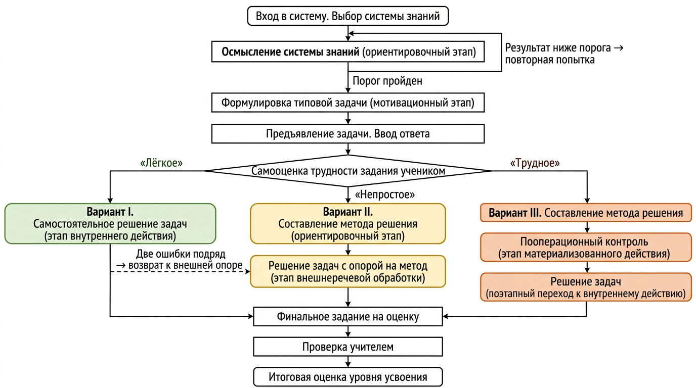
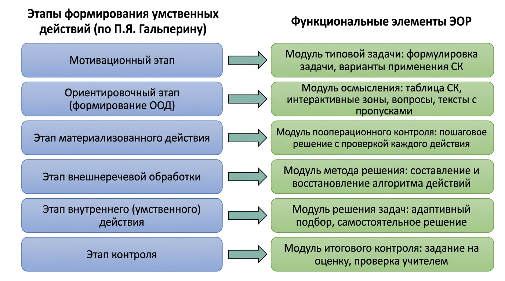

# ФИНАЛЬНАЯ ВЕРСИЯ СТАТЬИ

---

## 1. Название статьи

**Основное:** От теории поэтапного формирования умственных действий к электронному образовательному ресурсу по физике: педагогическое проектирование и реализация

**Запасное 1:** Проектирование электронного образовательного ресурса для усвоения систем физических знаний на основе концепции П. Я. Гальперина

**Запасное 2:** Электронный образовательный ресурс как средство организации поэтапного усвоения систем знаний о физических явлениях

---

## 2. Аннотация

В статье раскрывается логика проектирования электронного образовательного ресурса (ЭОР) по физике для основной школы, основанного на теории поэтапного формирования умственных действий П. Я. Гальперина. Показано, каким образом этапы усвоения, описанные в ТПФУД, и их конкретизация в методике обучения физике (три варианта последовательности формирования знаний и действий в зависимости от трудности задания для ученика) транслируются в педагогический алгоритм работы ресурса и его функциональную структуру. Описана модель организации учебной деятельности в ЭОР: от осмысления системы знаний о физическом явлении до контроля сформированности действия, с адаптивным выбором маршрута обучения. Представлены основные функциональные модули ресурса и их соответствие этапам формирования умственных действий. Статья носит теоретико-проектный характер; экспериментальная проверка эффективности ЭОР обозначена как перспектива дальнейших исследований.

---

## 3. Ключевые слова

Электронный образовательный ресурс, теория поэтапного формирования умственных действий, П. Я. Гальперин, система знаний, обучение физике, ориентировочная основа действия, адаптивное обучение, цифровая дидактика, основная школа.

---

## 4. УДК

**372.853 : 004.588**
(Методика преподавания физики : Интеллектуальные обучающие системы)

---

## 5. ПОЛНЫЙ ТЕКСТ СТАТЬИ

### Введение

Формирование у учащихся основной школы целостной системы знаний о физических явлениях — одна из центральных задач обучения физике. Федеральный государственный образовательный стандарт основного общего образования [1] и федеральная рабочая программа по физике [2] предъявляют к предметным результатам требования, предполагающие не изолированное запоминание формул и определений, а способность учащихся объяснять физические процессы с опорой на изученные свойства явлений, законы и модели, а также решать расчётные задачи с использованием систем уравнений.

Между тем анализ статистико-аналитических отчётов о результатах основного государственного экзамена по физике за 2024 год по ряду регионов России показывает, что задания, требующие применения системы знаний (задания повышенного и высокого уровней сложности), выполняются со средним процентом от 23 до 53 % [3]. Такие результаты указывают на системные затруднения школьников: учащиеся не могут выстроить объяснение из нескольких логических шагов, не владеют обобщённым способом решения задач, не умеют связывать элементы знания в единую систему.

Электронные образовательные ресурсы (ЭОР) обладают значительным потенциалом для преодоления указанных затруднений, поскольку способны обеспечить интерактивность учебной деятельности, мгновенную обратную связь и индивидуализацию образовательной траектории [4, 5]. Однако анализ существующих ЭОР по физике, в том числе ресурсов, включённых в федеральный перечень [6], свидетельствует о том, что они, как правило, ограничиваются демонстрационными материалами, наборами разрозненных задач или тестами с проверкой лишь на финальном этапе. Целенаправленная организация поэтапного усвоения целостной системы знаний в существующих цифровых решениях не представлена: контроль осуществляется преимущественно по конечному результату, без сопровождения ученика на промежуточных этапах формирования действия.

Одним из наиболее обоснованных оснований для проектирования ЭОР, обеспечивающего управляемое усвоение знаний, выступает теория поэтапного формирования умственных действий и понятий (ТПФУД), разработанная П. Я. Гальпериным [7, 8]. Эта теория описывает последовательность этапов интериоризации — перехода действия из внешнего, развёрнутого плана во внутренний, свёрнутый: от ориентировки и материализованного действия через внешнеречевую обработку к самостоятельному выполнению в умственном плане. Конкретизация данной теории применительно к обучению физике, развитая Л. А. Прояненковой [9, 10], позволяет для каждой системы знаний выделить три варианта последовательности этапов формирования, различающихся степенью развёрнутости внешних опор и соответствующих уровню подготовленности ученика.

Однако комплексный электронный образовательный ресурс, в котором этапы ТПФУД реализованы как элементы управляемого учебного процесса, а варианты маршрутов — как алгоритмически контролируемые переходы, до настоящего времени не был представлен. Таким образом, существует противоречие между дидактическим потенциалом теории поэтапного формирования умственных действий для организации усвоения систем физических знаний и отсутствием электронных образовательных ресурсов, реализующих эту теорию на уровне логики учебного взаимодействия.

**Цель статьи** — раскрыть логику проектирования электронного образовательного ресурса по физике для основной школы, в котором организация учебной деятельности выведена из теории поэтапного формирования умственных действий и её конкретизации в методике обучения физике.

### Методы исследования

В работе применён комплекс теоретических и проектных методов.

*Анализ психолого-педагогической и методической литературы* позволил выявить закономерности формирования систем знаний и действий, этапы усвоения умственных действий по П. Я. Гальперину [7, 8] и их конкретизацию в методике обучения физике [9, 10], а также выделить три варианта маршрута усвоения, различающихся полнотой внешней опоры.

*Анализ нормативных требований к ЭОР* (ФГОС ООО [1], ГОСТ Р 53620-2009 [4], приказ Минпросвещения России № 243 [5]) позволил определить функциональные и содержательные требования к проектируемому ресурсу: интерактивность, совместимость с различными устройствами, фиксация хода и результатов образовательного процесса.

*Теоретическое моделирование* использовано для построения обобщённой модели взаимодействия учителя и учащегося в процессе усвоения системы физических знаний. Модель описывает учебные действия, их последовательность и условия перехода между этапами.

*Педагогическое проектирование* применено для разработки алгоритма работы ЭОР: определены учебные сценарии для каждого из трёх вариантов маршрута, описаны условия переходов, виды обратной связи и точки принятия решений учеником.

*Структурно-функциональное моделирование* положено в основу проектирования функциональной архитектуры ресурса: выделены модули, соответствующие этапам формирования умственных действий, и определены связи между ними.

*Прототипирование* состояло в реализации функционального прототипа ЭОР и его верификации на соответствие педагогическому алгоритму.

### Педагогические основания проектирования ЭОР

#### Система знаний как единица усвоения

В основу проектируемого ЭОР положена идея о том, что единицей учебного содержания является не отдельное понятие или формула, а **система знаний** о физическом явлении — совокупность взаимосвязанных понятий, моделей и законов, необходимых для решения определённого класса задач. Такое понимание восходит к положениям ТПФУД: единицей обучения является действие, и для каждого элемента знания выделяется соответствующее учебное действие; совокупность таких действий образует систему знаний по предмету [7].

Организация учебного материала по системам знаний — а не по отдельным параграфам или заданиям — позволяет ученику воспринимать изучаемое содержание как целостную структуру, в которой каждый элемент связан с другими и служит основой для решения задач. Это принципиально отличает проектируемый ЭОР от большинства существующих ресурсов, где задачи предъявляются как отдельные, не связанные между собой упражнения.

#### Этапы формирования умственных действий

Теория П. Я. Гальперина описывает процесс усвоения нового действия как последовательность этапов, каждый из которых характеризуется определённой формой выполнения действия и степенью его интериоризации [7, 8]:

1. **Мотивационный этап** — создание условий для принятия учеником учебной цели: осознание того, для решения каких задач необходимы формируемые знания.
2. **Ориентировочный этап** — знакомство с ориентировочной основой действия (ООД): структурой знания, условиями выполнения и требованиями к результату.
3. **Этап материализованного действия** — выполнение действия в развёрнутой форме с внешней опорой (предметами, моделями, схемами), пошагово, с контролем каждой операции.
4. **Этап внешнеречевой обработки** — выполнение действия в речевой форме без непосредственной опоры на внешние предметы; проговаривание алгоритма как способ переноса действия во внутренний план.
5. **Этап внутреннего (умственного) действия** — самостоятельное выполнение действия в уме, без внешней поддержки; действие свёрнуто и автоматизировано.
6. **Этап контроля** — выполнение учебного задания в условиях внешнего контроля и самоконтроля для оценки сформированности действия.

Н. Ф. Талызина подчёркивает, что такая организация обучения обеспечивает не просто заучивание, а осознанное овладение способом действия, поскольку учащийся на каждом этапе понимает, что и зачем он делает [11].

#### Три варианта организации учебной деятельности

Принципиально важным для проектирования ЭОР является положение о том, что не все ученики нуждаются в одинаково развёрнутой последовательности этапов. Л. А. Прояненкова и соавторы [9] выделяют три варианта организации учебной деятельности при усвоении системы физических знаний, различающихся степенью трудности задания для ученика.

**Вариант I** (задание лёгкое для ученика): после ознакомления с заданием ученик сразу переходит к решению задачи в умственном плане, минуя развёрнутую внешнюю отработку. Маршрут включает: выбор системы знаний → осмысление → знакомство с заданием → самостоятельное решение серии задач → контроль.

**Вариант II** (задание непростое): ученик сначала составляет или восстанавливает обобщённый алгоритм действий (метод решения), а затем решает задачи, имея возможность обращаться к методу как к внешней опоре. Маршрут включает: выбор системы знаний → осмысление → знакомство с заданием → составление метода → решение задач с опорой на метод → контроль.

**Вариант III** (задание трудное): наиболее развёрнутый маршрут, включающий все формы действия. Ученик составляет метод, затем решает одну-две задачи с пооперационным контролем (шаг за шагом, с проверкой каждого действия), далее переходит к решению задач с проговариванием метода и лишь потом — к самостоятельному решению. Маршрут воспроизводит полный цикл этапов ТПФУД.

Во всех вариантах обязательны этап осмысления системы знаний (ориентировка) и заключительный контроль. Различия касаются центральной части: степени развёрнутости внешних действий и объёма предоставляемой ученику поддержки. Такой дифференцированный подход позволяет учитывать индивидуальные возможности: преуспевающие учащиеся не задерживаются на излишне простых шагах, а учащиеся, испытывающие затруднения, получают необходимую поддержку на промежуточных этапах [9].

#### Место учителя и ученика

В описанной модели учитель выступает не только как источник учебного содержания, но и как проектировщик учебной деятельности. Он создаёт системы знаний, формулирует вопросы для осмысления, разрабатывает метод решения задач и задачи различной трудности. Ученик, в свою очередь, является активным субъектом: он сам оценивает трудность задания и тем самым определяет маршрут обучения; он осмысливает систему знаний, восстанавливает метод решения, решает задачи и оценивает результат. ЭОР в этой модели выступает средством управления учебной деятельностью: он обеспечивает предъявление материала, поддержку на каждом этапе, автоматизированную обратную связь и фиксацию результатов.

### Алгоритм работы ЭОР в педагогическом плане

На основе описанных педагогических оснований спроектирован алгоритм работы электронного образовательного ресурса, воспроизводящий логику организации поэтапного усвоения системы знаний о физическом явлении (рис. 1).

*Рис. 1. Алгоритм взаимодействия ученика с электронным образовательным ресурсом (три варианта маршрута)*

#### Выбор системы знаний и осмысление

Работа ученика начинается с выбора системы знаний из каталога, организованного в соответствии со структурой учебной программы: класс — раздел — тема — система знаний. После выбора система создаёт учебную сессию, которая будет фиксировать прогресс ученика на протяжении всего маршрута.

Первым содержательным этапом является **осмысление системы знаний**, соответствующее ориентировочному этапу ТПФУД. Ученику предъявляется таблица или схема, представляющая систему знаний о физическом явлении: основные понятия, модели, законы и связи между ними. Эта таблица выполняет функцию **ориентировочной основы действия** (ООД): она показывает ученику структуру знания, условия и способы его применения.

Для проверки осмысления ученик отвечает на вопросы различных типов: выбор варианта ответа, соотнесение элементов таблицы с понятиями (выбор интерактивных зон на изображении), заполнение пропусков в тексте. Проверка выполняется автоматически; для прохождения этапа необходимо набрать не менее заданного учителем порога правильных ответов (по умолчанию — 85 %). При недостаточном результате ученик может повторить попытку, что обеспечивает возврат к осмыслению до тех пор, пока ориентировка не будет сформирована.

#### Формулировка типовой задачи

После успешного осмысления системы знаний ученику предъявляется **типовая задача** на применение данной системы. Этот этап выполняет мотивационную функцию: ученик осознаёт, для решения каких практических задач необходимы усвоенные знания. Ему предлагается определить формулировку типовой задачи из нескольких вариантов; после ответа предъявляется пояснение, раскрывающее цель и ситуации применения системы знаний.

#### Предъявление задачи и выяснение степени трудности

Далее ученику предъявляется первая конкретная задача. Он вводит ответ и получает обратную связь. После этого ученику предлагается **самостоятельно оценить трудность задания**: «лёгкое», «непростое» или «трудное». Самооценка определяет дальнейший маршрут — один из трёх вариантов, описанных выше. Таким образом, выбор маршрута осуществляется не системой извне, а самим учеником на основе рефлексии собственных затруднений, что соответствует принципу субъектности в обучении.

#### Вариант I: самостоятельное решение задач

Ученик, оценивший задание как лёгкое, переходит к самостоятельному решению серии задач. Он последовательно решает задачи, вводя числовой ответ. Система автоматически подбирает следующую задачу с учётом текущего уровня подготовленности ученика: при высокой успешности уровень сложности постепенно повышается, при затруднениях — снижается. Целевое количество задач для данного маршрута — пять.

Важным элементом является механизм поддержки при затруднениях: если ученик допускает две ошибки подряд, система предлагает перейти к более развёрнутому маршруту — составить метод решения или выполнить задание с пооперационным контролем. Тем самым реализуется дидактический принцип: при обнаружении затруднения обучение возвращается к более внешним формам действия.

#### Вариант II: составление метода и решение с опорой

Ученик, оценивший задание как непростое, сначала знакомится с **методом решения задач** — обобщённой последовательностью действий, вытекающей из системы знаний. Метод решения задач для каждой системы знаний представляет собой последовательность из десяти шагов, описывающих действия от выделения движущихся тел до формулировки ответа.

На этапе **составления метода** часть названий действий скрыта, и ученик должен восстановить их самостоятельно. Это обеспечивает активную переработку алгоритма: ученик не просто читает готовый текст, а воссоздаёт логику действий, что способствует более глубокому усвоению.

После составления метода ученик переходит к решению задач (целевое количество — шесть), имея возможность обращаться к системе знаний и методу решения в качестве подсказки. Этот маршрут соответствует сочетанию ориентировочного и внешнеречевого этапов по ТПФУД.

#### Вариант III: полный цикл формирования

Наиболее развёрнутый маршрут для ученика, оценившего задание как трудное, воспроизводит все этапы формирования умственного действия:

1. *Составление метода решения* — аналогично варианту II.
2. *Пооперационный контроль* — ученик решает одну-две задачи с проверкой каждого шага метода. На каждом шаге система предъявляет результат и предлагает ученику сравнить свой вариант с эталонным, после чего выбрать один из них для продолжения. Это соответствует этапу материализованного действия: ученик выполняет действие в развёрнутой форме, шаг за шагом, с контролем каждой операции.
3. *Решение задач с проговариванием* — ученик решает задачи, вспоминая и называя действия метода, но уже без пооперационного контроля. Доступ к подсказкам (системе знаний и методу решения) сохраняется. Это соответствует этапу внешнеречевой обработки.
4. *Самостоятельное решение* — решение задач без внешних опор, в свёрнутой форме. Это соответствует этапу внутреннего действия.

#### Адаптивный подбор задач

Независимо от маршрута система реализует адаптивный механизм подбора следующей задачи. Механизм учитывает: базовый уровень сложности, определяемый самооценкой ученика; текущую серию правильных или неправильных ответов; общий процент успешности в сессии. При высокой успешности уровень сложности повышается, при низкой — понижается. Тем самым обеспечивается нахождение задач в зоне ближайшего развития ученика, что является условием продуктивного обучения.

#### Контроль и оценка

Завершающим элементом каждого маршрута является **задание на оценку**. Ученик решает задачу и отправляет развёрнутое решение (в том числе фотографию письменной работы) на проверку учителю. Учитель проверяет решение, выставляет отметку и принимает или отклоняет работу. Итоговый уровень усвоения вычисляется как интегральный показатель, учитывающий автоматическую оценку (процент правильных ответов), экспертную оценку учителя и активность ученика в системе. Сочетание автоматизированного и экспертного контроля отвечает требованиям полноты диагностики: автоматическая проверка обеспечивает оперативную обратную связь на промежуточных этапах, а учительская экспертиза — качественную оценку итогового результата.

### Реализация педагогической модели в электронном образовательном ресурсе

Описанный педагогический алгоритм реализован в виде электронного образовательного ресурса, построенного как веб-приложение с двумя функциональными зонами — интерфейсом ученика и панелью учителя. Серверная часть ресурса обеспечивает хранение учебных данных, проверку ответов и управление маршрутом ученика; клиентская часть — интерактивное взаимодействие с учебным содержанием. Технологическая основа — связка серверного фреймворка на Python и библиотеки для построения пользовательских интерфейсов на JavaScript, с реляционной базой данных.

#### Функциональные модули и их педагогическое назначение

Структура ресурса подчинена педагогической логике: каждый функциональный модуль соответствует определённому этапу формирования умственных действий (рис. 2).

*Рис. 2. Соответствие этапов формирования умственных действий (по П. Я. Гальперину) и функциональных элементов электронного образовательного ресурса*

**Модуль осмысления системы знаний** реализует ориентировочный этап. Ученику предъявляется изображение таблицы системы знаний с размеченными интерактивными зонами. При ответе на вопросы типа «соответствие» ученик выбирает зоны на изображении, связывая элементы таблицы с понятиями. Поддерживаются четыре типа вопросов: открытый ответ, выбор одного или нескольких вариантов, соответствие зон, а также тексты с пропусками. Автоматическая проверка с обратной связью позволяет ученику увидеть, какие элементы системы знаний он осмыслил верно, а какие требуют повторного осмысления.

**Модуль типовой задачи** реализует мотивационный этап. Ученику предъявляются варианты формулировки типовой задачи на применение системы знаний; после выбора система предоставляет развёрнутое пояснение о цели и ситуациях применения.

**Модуль самооценки трудности** обеспечивает точку ветвления маршрута. После решения первой задачи ученик выбирает одну из трёх оценок: «лёгкое», «непростое», «трудное». Выбор ученика определяет дальнейшую последовательность этапов и целевое количество задач для решения.

**Модуль метода решения** реализует элемент ориентировочного этапа для вариантов II и III. Метод решения представлен как упорядоченная последовательность действий. В режиме составления метода часть названий действий скрыта; ученик восстанавливает их, что обеспечивает активную переработку алгоритма.

**Модуль пооперационного контроля** реализует этап материализованного действия для варианта III. Ученик решает задачу шаг за шагом по методу решения; на каждом шаге система проверяет ответ и предъявляет эталонный результат. Ученик может выбрать свой вариант ответа или вариант системы, что развивает навыки самоконтроля и рефлексии.

**Модуль решения задач** реализует этапы внешнеречевой обработки и внутреннего действия. Система адаптивно подбирает задачи, корректируя уровень сложности в зависимости от текущих результатов ученика. В режиме решения с опорой на метод (вариант II) ученику доступны кнопки-подсказки для обращения к системе знаний и методу решения; в режиме самостоятельного решения (вариант I) подсказки отсутствуют.

**Модуль итогового контроля** реализует этап контроля. Финальная задача предполагает развёрнутое решение с возможностью загрузки фотографии письменной работы. Учитель проверяет работу и выставляет оценку. Итоговый уровень усвоения вычисляется как интегральный показатель с учётом автоматической и экспертной оценок.

#### Управление маршрутом ученика

Переходы между этапами контролируются системой: для каждого текущего этапа определено множество допустимых следующих этапов. Это гарантирует целостность педагогического алгоритма: ученик не может пропустить обязательный этап, но может быть автоматически направлен на дополнительный этап поддержки при обнаружении затруднений.

Система фиксирует прогресс ученика на протяжении всего маршрута: текущий этап, выбранную оценку трудности, количество решённых и правильно решённых задач, серию ошибок, историю ответов на каждом шаге метода. Эти данные используются для адаптивного подбора задач и для формирования итоговой оценки, а также доступны учителю для анализа затруднений.

#### Интерфейс учителя

Панель учителя позволяет создавать и редактировать учебное содержание без знания технических деталей работы системы. Учитель может:
- создавать иерархическую структуру курса (разделы, темы, системы знаний);
- загружать изображения таблиц систем знаний и размечать на них интерактивные зоны;
- формулировать вопросы различных типов для этапа осмысления;
- создавать тексты с пропусками;
- разрабатывать метод решения задач (последовательность шагов с описаниями и подсказками);
- создавать задачи с указанием уровня сложности, правильного ответа и эталонного решения;
- создавать графические схемы «модели ситуации» к задачам с помощью встроенного редактора векторной графики;
- проверять финальные работы учеников и выставлять оценки.

Наличие такого инструмента критически важно для практического применения ресурса: учитель-предметник может самостоятельно наполнять ЭОР учебным содержанием для любой системы знаний курса физики 7–9 классов, не прибегая к помощи программиста.

#### Редактор графических схем

Отдельным функциональным элементом является редактор графических схем, предназначенный для создания и проверки **моделей ситуации** задач. Построение графической модели ситуации является одним из шагов метода решения физических задач: ученик визуализирует условие, выделяя тела, силы, направления движения и другие элементы. Редактор предоставляет палитру стандартных графических элементов (точки, тела, векторы, линии координат, текстовые подписи), инструменты для их размещения и редактирования на холсте. Учитель создаёт эталонную схему; ученик строит свою схему при решении задачи, что обеспечивает визуализацию физической ситуации и способствует формированию модельных представлений.

### Заключение

В настоящей статье раскрыта логика проектирования электронного образовательного ресурса по физике для основной школы, основанного на теории поэтапного формирования умственных действий П. Я. Гальперина.

Предложена и реализована модель ЭОР, в которой:
- единицей учебного содержания является система знаний о физическом явлении, а не отдельное задание или параграф;
- педагогический алгоритм работы ресурса воспроизводит этапы формирования умственных действий: от ориентировки (осмысление системы знаний) через материализованное и речевое действие к самостоятельному решению в умственном плане;
- три варианта маршрута обучения, описанные Л. А. Прояненковой для работы с системами физических знаний, реализованы как управляемые переходы между этапами;
- выбор маршрута определяется самооценкой учеником трудности задания, что обеспечивает индивидуализацию обучения;
- при обнаружении затруднений (серия ошибок) система автоматически возвращает ученика к более развёрнутым формам действия;
- завершающий контроль сочетает автоматизированную и экспертную (учительскую) оценку.

Научно-методическая новизна состоит в том, что впервые предложена модель электронного образовательного ресурса, в которой функциональная структура системы непосредственно выведена из этапов ТПФУД и их конкретизации для обучения физике, а варианты последовательности усвоения реализованы как алгоритмически управляемые маршруты.

Практическая значимость определяется тем, что разработан функциональный прототип ЭОР, который предоставляет учителю физики инструменты для самостоятельного создания учебного содержания и может быть развёрнут в школьной образовательной среде. Архитектура ресурса допускает адаптацию для иных естественно-научных дисциплин при сохранении общей логики поэтапного усвоения.

Перспективы дальнейших исследований связаны с проведением педагогического эксперимента для оценки влияния разработанного ЭОР на результаты обучения физике, с разработкой банков заданий по различным системам знаний курса физики 7–9 классов, а также с расширением адаптивных алгоритмов подбора заданий.

---

## 6. СПИСОК ЛИТЕРАТУРЫ

1. Об утверждении федерального государственного образовательного стандарта основного общего образования : приказ Минпросвещения России от 31.05.2021 № 287 // Консультант Плюс : справочно-правовая система.
2. Федеральная рабочая программа основного общего образования. Физика (базовый уровень) [Электронный ресурс] // Единое содержание общего образования. — URL: https://edsoo.ru/ (дата обращения: 19.12.2024).
3. Методический анализ результатов ОГЭ по физике : статистико-аналитические отчёты по регионам России за 2024 год. — Калининградская обл., Алтайский край, Курганская обл. и др.
4. ГОСТ Р 53620-2009. Информационно-коммуникационные технологии в образовании. Электронные образовательные ресурсы. Общие положения. — М. : Стандартинформ, 2018. — 11 с.
5. Об утверждении Порядка формирования федерального перечня электронных образовательных ресурсов : приказ Минпросвещения России от 15.04.2022 № 243.
6. Об утверждении федерального перечня электронных образовательных ресурсов : приказ Минпросвещения России от 18.07.2024 № 499.
7. Гальперин, П. Я. Основные результаты исследований по проблеме «Формирование умственных действий и понятий» / П. Я. Гальперин. — М. : Изд-во Моск. ун-та, 1965. — 52 с.
8. Гальперин, П. Я. Лекции по психологии : учебное пособие / П. Я. Гальперин. — М. : Книжный дом «Университет», 2008. — 332 с.
9. Прояненкова, Л. А. [Теория и методика обучения физике: организация усвоения систем физических знаний]. — *Уточнить полное библиографическое описание основного методического труда (источник [19] в диплом. работе).*
10. Прояненкова, Л. А. Деятельностный подход в обучении физике / Л. А. Прояненкова // Физика в школе. — 2005. — № 1.
11. Талызина, Н. Ф. Деятельностная теория учения / Н. Ф. Талызина. — М. : МГУ, 2018. — 438 с.
12. Федеральный закон «Об образовании в Российской Федерации» от 29.12.2012 № 273-ФЗ.
13. Давыдов, В. В. Теория развивающего обучения / В. В. Давыдов. — М. : ИНТОР, 1996. — 544 с.

> **Примечание.** Источник [9] требует уточнения полного библиографического описания по данным научного руководителя Л. А. Прояненковой. В дипломной работе он указан как [19].

---

## 7. ПОДПИСИ К РИСУНКАМ

**Рис. 1.** Алгоритм взаимодействия ученика с электронным образовательным ресурсом (три варианта маршрута в зависимости от самооценки трудности задания)

**Рис. 2.** Соответствие этапов формирования умственных действий (по П. Я. Гальперину) и функциональных элементов электронного образовательного ресурса

---

## 8. КОММЕНТАРИЙ: ЧТО БЫЛО СОЗНАТЕЛЬНО ИЗМЕНЕНО

### Что убрано или сокращено как слишком ИТ-ориентированное:

1. **Названия файлов, компонентов и классов** (`App.jsx`, `StageComprehension`, `TeacherApp.jsx`, `KnowledgeSystemViewSet`, `LearningSessionViewSet` и т.п.) — заменены на функциональные описания модулей.

2. **Перечисления полей моделей данных** (все поля `LearningSession`, `Task`, `KnowledgeSystem` с их типами) — убраны; вместо этого описана педагогическая функция хранимых данных.

3. **Названия API-эндпоинтов** (`POST /api/ks/{id}/check/`, `GET /api/session/{id}/next_task/` и др.) — полностью убраны.

4. **Технические детали стека** (Django REST Framework, Vite, Tailwind CSS, CSRF-аутентификация, SessionAuthentication) — заменены на краткое обобщённое описание технологической основы.

5. **ER-диаграмма базы данных** — исключена из рисунков как слишком техническая для педагогической статьи.

6. **Схема архитектуры** — исключена; технологическая архитектура упомянута одним абзацем.

7. **Формула `mastery_percent`** с коэффициентами 0.60/0.30/0.10 — заменена на словесное описание интегрального показателя.

8. **Описание адаптивного алгоритма** с числовыми порогами (≥ 0.8, < 0.6, wrong_attempts_in_row ≥ 2) — заменено на педагогическое описание принципа адаптации.

9. **Раздел про редактор схем Konva.js** (undo/redo, snap-to-grid, контекстное меню, множественное выделение) — сокращён до педагогической функции редактора.

### Что сохранено и переведено на педагогический язык:

1. Логика трёх маршрутов (варианты I, II, III) — сохранена полностью, но описана как организация учебной деятельности, а не как переходы между состояниями программы.

2. Адаптивный подбор задач — описан как дидактический механизм, а не как алгоритм с числовыми порогами.

3. Сценарий «двух ошибок» — описан как дидактический принцип возврата к внешней опоре.

4. Интегральная оценка — описана как сочетание автоматизированной и экспертной оценки.

5. Интерфейс учителя — описан как инструмент для учителя-предметника, без перечисления CRUD-операций и API.

6. Все модули ресурса — описаны через их педагогическую функцию (какой этап ТПФУД реализуют), а не через внутреннее устройство.
